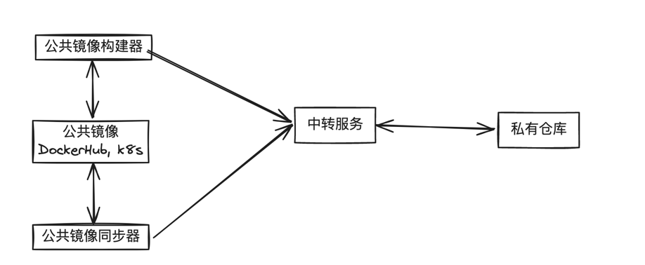

# public-image-syncer

完成了公共镜像同步, 基于公共镜像构建, 两项功能

## 同步流程描述

1. 公共镜像同步器, 将镜像拉取到阿里云镜像仓库
2. 公共镜像构建器, 将镜像构建后推送到阿里云镜像仓库
3. Teamcity 将阿里云镜像仓库中的镜像拉取到私服

## 同步过程

1. 利用GitHub Action同步镜像或者构建镜像至阿里云北京站
2. 利用Teamcity同步镜像至私服, 注意: 使用 main.py 生成配置文件

## 项目结构

* [auth.yaml](config/images.yaml): 认证配置
* [images.yaml](config/images.yaml): 公共镜像同步器同步配置
* [Earthfile](Earthfile): 基于公共镜像进行构建的镜像, 构建后以tag -n-ext 结尾
* [build-images.yaml](config/build-images.yaml): 构建的镜像同步配置

## 镜像库映射规则描述

@formatter:off
1. docker.io镜像, 官方镜像放在library项目下, 机构镜像放在相应的机构下
    1. 官方镜像:
       example: docker.io/nginx:1.17.4 
             -> registry.cn-beijing.aliyuncs.com/public-image-mirror/docker.io_nginx:1.17.4
             -> docker-hosted.nstl-dev.com/library/nginx:1.17.4
    2. 机构镜像:
       example: docker.io/adoptopenjdk/openjdk11:latest 
             -> registry.cn-beijing.aliyuncs.com/public-image-mirror/docker.io_adoptopenjdk_openjdk11:latest
             -> docker-hosted.nstl-dev.com/adoptopenjdk/openjdk11:latest
2. ghcr.io镜像
    1. kube-vip:
       example: ghcr.io/kube-vip/kube-vip:v0.5.0
             -> registry.cn-beijing.aliyuncs.com/public-image-mirror/ghcr.io_kube-vip_kube-vip:latest
             -> docker-hosted.nstl-dev.com/ghcr.io/kube-vip/kube-vip:v0.5.0
3. registry.k8s.io k8s 镜像特殊处理:
    1. 映射至私有仓库google_containers项目下:
       example: registry.k8s.io/kube-proxy:v1.28.0
             -> registry.cn-beijing.aliyuncs.com/nstl_google_containers/kube-proxy:v1.28.0
             -> docker-hosted.nstl-dev.com/google_containers/kube-proxy:v1.28.0 
    2. coredns特殊处理, coredns镜像/coredns/coredns路径变为/coredns打平映射:
       example: registry.k8s.io/coredns/coredns:latest
       -> registry.cn-beijing.aliyuncs.com/nstl_google_containers/coredns:latest
       -> docker-hosted.nstl-dev.com/google_containers/coredns:latest
    3. kubeadm 使用时 --image-repository docker-hosted.nstl-dev.com/google_containers
4. docker.elastic.co 镜像特殊处理, DockerHub上elastic的镜像不全, 只有几个最新版本的镜像:
    1. docker.elastic.co/elasticsearch/elasticsearch -> docker-hosted.nstl-dev.com/library/elasticsearch
    2. docker.elastic.co/logstash/logstash -> docker-hosted.nstl-dev.com/library/logstash
    3. docker.elastic.co/kibana/kibana -> docker-hosted.nstl-dev.com/library/kibana
    4. docker.elastic.co/beats/filebeat-> docker-hosted.nstl-dev.com/library/filebeat
5. 自定义的公共镜像的拓展镜像, 使用[build-images.yaml](config/build-images.yaml)规则文件中的描述, 映射成相应的镜像
    1. 镜像分为一次性构建镜像和持续构建镜像, 持续构建镜像会定时构建, 一次性构建镜像只会在手动构建时触发

@formatter:on

## 同步器来自于

image-syncer-v1.5.4
https://github.com/AliyunContainerService/image-syncer